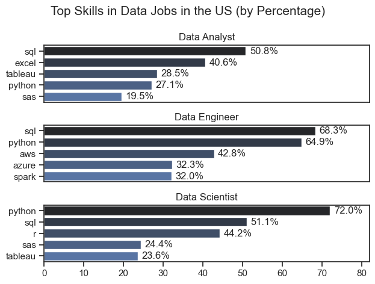
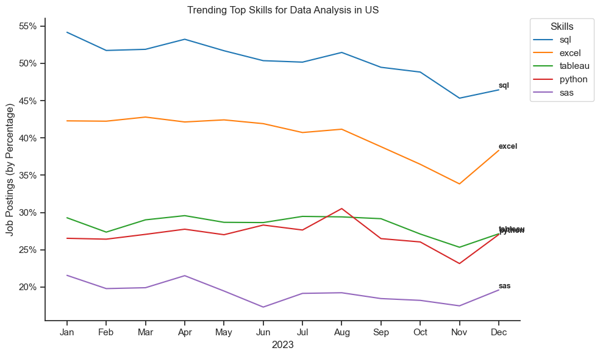
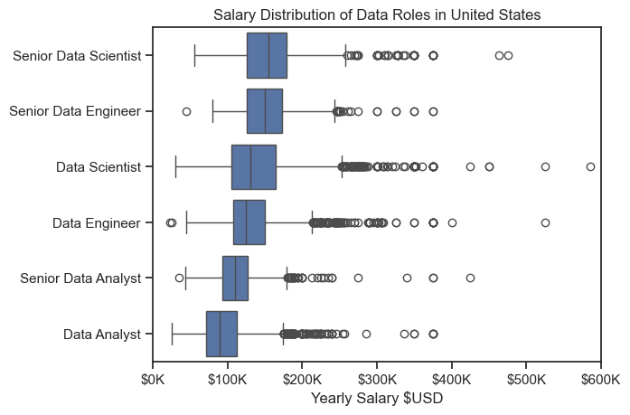
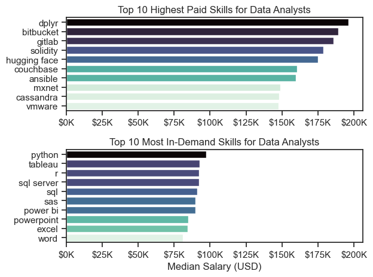
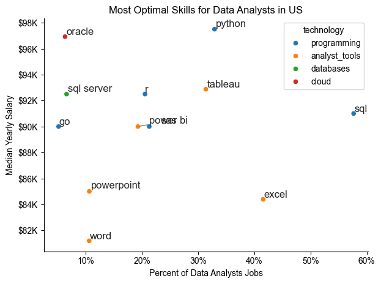

# Python Data Analytics: Exploring the Data Analyst Job Market

Welcome to my analysis of the **data analyst job market**, a project inspired by the need to better understand the evolving landscape of tech roles. This analysis focuses on identifying **top-paying** and **in-demand skills** to help uncover optimal career opportunities for aspiring and current data analysts.

---

## Acknowledgments

This project was developed under the guidance of **Luke Barousse** as part of his *Python for Data Analytics* course. Huge thanks to him for creating such a practical and impactful learning experience.

- Original dataset: [`lukebarousse/data_jobs`](https://huggingface.co/datasets/lukebarousse/data_jobs)
- Course Link: [Python for Data Analytics](https://www.youtube.com/@LukeBarousse)
---

## Project Goals

This project seeks to answer key questions that matter for job seekers in the analytics space:

1. **What are the most in-demand skills for the top 3 data job roles?**
2. **How are skill trends evolving for Data Analysts?**
3. **Which skills and jobs offer the highest salaries for Data Analysts?**
4. **What are the optimal skills to learn?** (i.e., high in demand *and* high in salary)

---

## Tools & Technologies

To explore these questions, I used the following tools and libraries:

- **Python** – The core language powering the analysis.
- **Pandas** – For data manipulation and preprocessing.
- **Matplotlib** – For foundational data visualizations.
- **Seaborn** – For advanced and aesthetic plots.
- **Jupyter Notebooks** – For interactive coding, notes, and exploration.
- **Visual Studio Code** – My primary development environment.
- **Git & GitHub** – For version control, collaboration, and sharing code.

---

## 🧼 Data Preparation & Cleanup

**🔹 Step 1: Import Libraries**

```python
import ast
import pandas as pd
import seaborn as sns
from datasets import load_dataset
import matplotlib.pyplot as plt
```
**🔹 Step 2: Load the Dataset**
```python
dataset = load_dataset('lukebarousse/data_jobs')
df = dataset['train'].to_pandas()
```
**🔹 Step 3: Clean & Convert Data Types**
```python
df['job_posted_date'] = pd.to_datetime(df['job_posted_date'])

# Convert job_skills column from string to dictionary
df['job_skills'] = df['job_skills'].apply(lambda x: ast.literal_eval(x) if pd.notna(x) else x)
```
**🔹 Step 4: Filter U.S.-Based Job Listings**
```python
df_US = df[df['job_country'] == 'United States']
```
# The Analysis

## 1. What Are the Most In-Demand Skills for the Top 3 Data Roles?

To identify the most in-demand skills, I analyzed job listings for the **top three most popular data roles** in the US: **Data Analyst**, **Data Engineer**, and **Data Scientist**. From this analysis, I extracted the **top 5 skills** required for each role.

This visualization highlights which technical skills are most valued by employers depending on the role. It’s a helpful reference for anyone looking to focus their learning based on a specific career path in data.

**Why this matters**: Knowing the right tools and languages for your target role helps you study smarter and build a more relevant skill set.

**See the full analysis and steps in the notebook**:
[📂 View Notebook → `2_Skill_Demand.ipynb`](02_Project/2_Skill_Demand.ipynb)

---

### Visualize Data

```python
fig, ax = plt.subplots(len(job_titles), 1)

for i, job_title in enumerate(job_titles):
    df_plot = df_skills_perc[df_skills_perc['job_title_short'] == job_title].head(5)
    sns.barplot(
        data=df_plot, 
        x='skill_percent', 
        y='job_skills', 
        hue='job_skills',
        ax=ax[i], 
        palette='dark:b')
    
    ax[i].set_title(job_title)
    ax[i].set_xlabel('')
    ax[i].set_ylabel('')
    ax[i].set_xlim(0, 82)

    for idx, v in enumerate(df_plot['skill_percent']):
        ax[i].text(v + 1, idx, f"{v:.1f}%", va='center')
    
    if i != len(job_titles) - 1:
        ax[i].set_xticks([])

fig.suptitle('Top Skills in Data Jobs in the US (by Percentage)', fontsize=15)      
plt.tight_layout()
plt.show()
```

---

### Results



---

### Insights

This chart highlights the most in-demand skills across three key data roles in the US job market: **Data Analyst**, **Data Engineer**, and **Data Scientist**.

#### 1. **SQL Is Essential Across All Roles**

* Consistently ranked as a top skill:

  * Data Engineer: **68.3%**
  * Data Scientist: **51.1%**
  * Data Analyst: **50.8%**
* 💡 *SQL is the foundational skill for working with data in almost every role.*

#### 2. **Python Dominates for Engineers and Scientists**

* Data Scientist: **72.0%**
* Data Engineer: **64.9%**
* Data Analyst: **27.1%**
* 💡 *Python is crucial for automation, analysis, and machine learning.*

#### 3. **Data Analysts Focus on Business Tools**

* Excel: **40.6%**
* Tableau: **28.5%**
* SAS: **19.5%**
* 💡 *Analysts rely on accessible tools for reporting and dashboards.*

#### 4. **Cloud and Big Data Are Key for Data Engineers**

* AWS: **42.8%**
* Azure: **32.3%**
* Spark: **32.0%**
* 💡 *Engineers need cloud and distributed computing skills to build data pipelines.*

#### 5. **Data Scientists Blend Programming with Statistics**

* R: **44.2%**
* SAS: **24.4%**
* Tableau: **23.6%**
* 💡 *Statistical analysis and visualization tools support advanced analytics.*

---

### Role-Specific Skills Overview

| Skill Area             | Data Analyst     | Data Engineer       | Data Scientist    |
| ---------------------- | ---------------- | ------------------- | ----------------- |
| **SQL**                | ✅ Core           | ✅ Core              | ✅ Core            |
| **Python**             | ⚠️ Optional      | ✅ Core              | ✅ Core            |
| **Cloud / Big Data**   | ❌ Not Required   | ✅ AWS, Azure, Spark | ⚠️ Sometimes Used |
| **Business Tools**     | ✅ Excel, Tableau | ❌ Not Needed        | ⚠️ Sometimes Used |
| **Statistics (R/SAS)** | ⚠️ Optional      | ❌ Not Needed        | ✅ R, SAS          |

---

>  *These insights are based on a breakdown of skill mentions in US job postings in 2023. Use this as a guide for skill development based on your target role.*

---

## 2. How are in-demand skills trending for Data Analyst?
To examine how skill demand has shifted over time for **Data Analyst roles**, I tracked monthly changes in job postings throughout **2023**. The focus was on top five key skills: **SQL, Excel, Tableau, Python, and SAS.**

**See the full analysis and steps in the notebook**:
[📂 View Notebook → `3_Skill_Trend.ipynb`](02_Project/3_Skill_Trend.ipynb)

---

### Visualize Data

```python
from matplotlib.ticker import PercentFormatter

sns.set_theme(style='ticks')
plt.figure(figsize=(10, 6))

sns.lineplot(data=df_plot, dashes=False, palette='tab10')
sns.despine()

for skill in df_plot.columns:
    x = df_plot.index[-1]
    y = df_plot[skill].iloc[-1]

    plt.text(
        x=x,
        y=y + 0.5,
        s=skill,
        fontsize=9,
        va='center',
        ha='left',
        fontweight='bold'
    )

plt.legend(
    title='Skills',
    bbox_to_anchor=(1.02, 1),
    loc='upper left',
    borderaxespad=0
)

plt.gca().yaxis.set_major_formatter(PercentFormatter(decimals=0))

plt.title("Trending Top Skills for Data Analysis in US")
plt.xlabel("2023")
plt.ylabel("Job Postings (by Percentage)")
plt.tight_layout()
plt.show()
```

---

### Results


*Bar graph visualizing the trending top skills for data analysts in US in 2023.*

---

### Insights

- **SQL**  
  Remained the most consistently in-demand skill throughout the year, with demand staying **above 45%** and peaking at **54%**.  
  _✅ A core competency for data analysts—essential for querying and managing relational data._

- **Excel**  
  Held steady as the second most in-demand skill, though it declined mid-year to around **33-36%**, followed by a modest rebound.  
  _⚠️ Still widely used, especially in business settings, but shows signs of being gradually replaced by more technical tools._

- **Python & Tableau**  
  Both skills tracked closely, fluctuating between **26–30%** across the year.  
  _🧠 Reflects increasing expectations for data analysts to be capable in scripting and data visualization._

- **SAS**  
  Had the lowest and most steadily declining demand, finishing the year below **20%**.  
  _📉 Indicates a continuing shift away from legacy tools toward open-source alternatives like Python and R._

---

### Summary Table

| Skill       | Trend            | Commentary                             |
|-------------|------------------|----------------------------------------|
| **SQL**     | 🔼 Stable High    | Still the most essential data skill    |
| **Excel**   | 🔽 Gradual Decline| Losing ground to technical tools       |
| **Python**  | 🔄 Fluctuating    | Growing demand for programming         |
| **Tableau** | 🔄 Fluctuating    | Valuable for visualization             |
| **SAS**     | 🔻 Declining      | Being phased out by modern alternatives |

---

## 3. How well do jobs and skills pay for Data Analysts?

This boxplot visualizes the distribution of **yearly salaries (USD)** across six common data-related job titles in the US for 2023. It highlights medians, ranges, and outliers for each role.

**See the full analysis and steps in the notebook**:
[📂 View Notebook → `4_Salary_Analysis.ipynb`](02_Project/4_Salary_Analysis.ipynb)

### Visualize Data

```python
sns.set_theme(style='ticks')
sns.boxplot(
    data=df_US_top6, 
    x='salary_year_avg', 
    y='job_title_short',
    order=job_order)

plt.title('Salary Distribution of Data Roles in US')
plt.xlabel('Yearly Salary $USD')
plt.ylabel('')
ticks_x = plt.FuncFormatter(lambda x, pos: f"${int(x/1000)}K")
plt.gca().xaxis.set_major_formatter(ticks_x)
plt.xlim(0, 600000)
plt.show()
```

---

### Results



---

### Insights

- **🔼 Senior roles pay significantly more** than their mid-level counterparts:
  - **Senior Data Scientist** and **Senior Data Engineer** have the **highest median salaries**, often exceeding **$150K–$155K**.
  - **Senior Data Analyst** shows a noticeable jump from regular analyst roles, with median salaries around **$110K**.

- **📊 Data Scientists and Engineers lead mid-level roles**:
  - Median salaries for **Data Scientists** and **Data Engineers** fall around **$125K–$130K**.
  - Both roles also show a **broader range of salaries** and more high-paying outliers compared to analyst roles.

- **📉 Data Analysts earn the lowest on average**:
  - **Data Analysts** have the lowest median salary (approx. **$90K**), with a tighter salary range.
  - Despite lower base pay, some outliers reach well beyond **$200K**, likely reflecting niche skills or high-paying industries.

- **💡 Outliers are frequent** in technical roles:
  - High-end outliers beyond **$300K–$500K** appear in all roles but are most prevalent among **Data Scientists** and **Data Engineers**.
  - Suggests opportunities for very high compensation in specialized or high-level positions (e.g., FAANG, finance, or AI-focused roles).

---

### Summary Table

| Role                  | Median Salary (Est.) | Salary Range (Typical) | Notable Insight                                      |
|-----------------------|----------------------|-------------------------|------------------------------------------------------|
| **Senior Data Scientist** | ~$155K           | $140K–$220K+            | Highest compensation, many outliers                 |
| **Senior Data Engineer**  | ~$150K           | $140K–$210K+            | Strong demand + backend/data infra skills rewarded  |
| **Data Scientist**        | ~$130K           | $110K–$200K             | High variance and growth potential                  |
| **Data Engineer**         | ~$125K           | $110K–$190K             | Technical + scalable skills boost salary            |
| **Senior Data Analyst**   | ~$110K           | $100K–$170K             | Leadership & domain expertise influence pay         |
| **Data Analyst**          | ~$90K           | $80K–$130K              | Entry-level, but upward mobility possible           |

---

### Highest Paid & Most Demanded Skills for Data Analyst

This analysis compares the **Top 10 Highest Paid** and **Top 10 Most In-Demand** skills for data analysts in the United States.

Visuals are based on filtered US job postings and salary data.

---

### Visualize Data
```python
fig, ax = plt.subplots(2, 1)

sns.set_theme(style='ticks')

sns.barplot(
    data=df_DA_top_pay, 
    x='median', 
    y=df_DA_top_pay.index, 
    ax=ax[0],
    hue='median', 
    palette='mako_r', 
    legend=False)
ax[0].set_title('Top 10 Highest Paid Skills for Data Analysts')
ax[0].set_xlabel('')
ax[0].set_ylabel('')
ax[0].xaxis.set_major_formatter(plt.FuncFormatter(lambda x, pos: f"${int(x/1000)}K"))

sns.barplot(
    data=df_DA_top_skills, 
    x='median', 
    y=df_DA_top_skills.index, 
    ax=ax[1],
    hue='median', 
    palette='mako_r', 
    legend=False)
ax[1].set_title('Top 10 Most In-Demand Skills for Data Analysts')
ax[1].set_xlabel('Median Salary (USD)')
ax[1].set_ylabel('')
ax[1].set_xlim(ax[0].get_xlim())
ax[1].xaxis.set_major_formatter(plt.FuncFormatter(lambda x, pos: f"${int(x/1000)}K"))

plt.tight_layout()
plt.show()
```

---

### Results


---

### Insights

---

#### Top 10 Highest Paid Skills for Data Analysts in US
> ⚠️ **Note**: These skills appear in **very few job postings (ultra-niche)** — while salaries are high, they reflect **highly specialized or rare roles**.

--- 

#### Key Takeaways

- **Rare ≠ Widely Needed**  
  - Tools like `dplyr`, `bitbucket`, `gitlab`, and `solidity` offer **median salaries around $180K–$200K**, but demand is extremely low.
  - These results may reflect **outliers or specialized sectors**:
    - `dplyr`: Popular in niche R workflows.
    - `solidity`: High-paying blockchain/smart contract roles.
    - `hugging face`, `mxnet`: NLP/AI deep-tech positions.

- **Strategic Insight**  
  - Pursue these only if you're targeting **elite or emerging tech roles**.
  - Great for **niche specialization**, but not reliable for general job-hunting.

---

#### Top 10 Most In-Demand Skills for Data Analysts (U.S.)

> These skills appear in **a large volume of job listings**, representing core requirements for the U.S. data analyst job market.

#### Key Takeaways

- **Core Competencies Rule**  
  - `Python`, `SQL`, `R`, and `Tableau` are fundamental to nearly every data analyst position.
  - They offer **strong job security** with **competitive salaries**.

- **BI & Communication Skills Matter**  
  - Tools like `Power BI`, `PowerPoint`, and `Excel` show that **presenting data is as important as analyzing it**.

- **Legacy Skills Still Valuable**  
  - `SAS` and `SQL Server` remain staples in **finance, healthcare, and government** sectors.

#### Strategic Insight

- These are the **"must-have" skills** to become market-ready.
- While individual salaries may not match niche tools, **a well-rounded stack makes you highly employable**.

---

#### Conclusion & Strategy

| Focus Area             | Why It Matters                                          | Action Suggestion                                |
|------------------------|---------------------------------------------------------|--------------------------------------------------|
| **In-Demand Skills**   | Broad job opportunities                                 | Build fluency in `Python`, `SQL`, `Tableau`      |
| **Niche High-Pay Skills** | Big salary upside, but low availability              | Specialize in 1–2 (e.g., `Hugging Face`, `Solidity`) |
| **Communication Tools** | Analysts must tell stories, not just analyze           | Practice dashboards, presentations, storytelling |
| **U.S. Focus**         | Reflects realistic job expectations                     | Prioritize skills aligned with local demand      |

---

📌 *Tip:*  
If you're just starting out — focus on **high-demand basics**.  
If you're established — add **high-paying niche tools** to boost your salary potential.

---

## 4. What is the most optimal skill to learn for Data Analysts?
This scatterplot visualizes the **intersection of salary and demand** for various data analyst skills in the US job market 2023.

**See the full analysis and steps in the notebook**:
[📂 View Notebook → `5_Optimal_Skill.ipynb`](02_Project/5_Optimal_Skill.ipynb)

---

### Visualize Data
```python
from adjustText import adjust_text
from matplotlib.ticker import PercentFormatter
df_DA_skills_high_demand.plot(kind='scatter', x='skill_percent', y='median_salary')

plt.title(f"Most Optimal Skills for Data Analysts in US")
plt.xlabel('Percent of Data Analysts Jobs')
plt.ylabel('Median Yearly Salary')
plt.tight_layout()

texts = []

for i, x in enumerate(df_DA_skills_high_demand.index):
    texts.append(plt.text(df_DA_skills_high_demand['skill_percent'].iloc[i], df_DA_skills_high_demand['median_salary'].iloc[i], x))

ax = plt.gca()
ax.xaxis.set_major_formatter(PercentFormatter())
ax.yaxis.set_major_formatter(plt.FuncFormatter(lambda y, pos: f"${int(y/1000)}K"))
adjust_text(texts, arrowprops=dict(arrowstyle='->', color='gray', lw=1))

plt.show()
```

---

### Results


*A Scatter plot visualizing the most optimal skills (high pay & demand) for data analysts in US.*

---

### Insights

Each point represents a skill, categorized by type:
- **X-axis** → Popularity (% of job postings mentioning the skill)
- **Y-axis** → Median Yearly Salary
- **Color** → Type of technology (`programming`, `analyst_tools`, `databases`, `cloud`)

### 🔹 Top Performers (High Salary + High Demand)
| Skill   | Popularity | Salary   | Notes |
|---------|------------|----------|-------|
| `SQL`   | ~57%       | ~$91K    | Most in-demand skill across all analyst roles. Essential. |
| `Python`| ~32%       | ~$97K    | Highest salary; widely used for automation, scripting, and ML. |
| `Tableau`| ~31%      | ~$92K    | Leading BI tool, very relevant for dashboarding and reporting. |

---

### 🟠 Widespread but Lower Paying
| Skill         | Popularity | Salary   | Notes |
|---------------|------------|----------|-------|
| `Excel`       | ~41%       | ~$84K    | Core spreadsheet tool, but commoditized. |
| `PowerPoint`  | ~10%       | ~$85K    | Useful for presenting insights, but low salary signal. |
| `Word`        | ~10%       | ~$81K    | Often included in listings by default — not a differentiator. |

---

### 🔴 Niche but High Paying
| Skill   | Popularity | Salary   | Notes |
|---------|------------|----------|-------|
| `Oracle`| ~6%        | ~$96K    | Rare in postings but pays well, often linked to legacy enterprise systems. |
| `Go`    | ~5%        | ~$90K    | Uncommon in analyst roles, but strong in backend/data engineering contexts. |

---

### 🟢 Mid-Range Opportunities
| Skill         | Popularity | Salary   | Notes |
|---------------|------------|----------|-------|
| `Power BI`    | ~19%       | ~$90K    | Microsoft's BI tool; widely adopted in enterprises. |
| `R`           | ~20%       | ~$92K    | Statistical programming, useful in research and analytics. |
| `SQL Server`  | ~6%       | ~$92K    | Still used heavily in corporate environments. |

---

### Strategic Takeaways

| Goal                     | Skills to Prioritize                             |
|--------------------------|--------------------------------------------------|
| Get Hired Fast         | `SQL`, `Excel`, `Tableau`                        |
| Maximize Salary        | `Python`, `Oracle`, `Go`                         |
| Build Analyst Stack    | Add `Power BI`, `R`, `SQL Server`               |
| Don’t Overfocus On     | `Word`, `PowerPoint` — important but low leverage |

---

### Summary

The **sweet spot** for U.S. data analysts in 2023 is:

> 📦 `SQL` + `Python` + `Tableau`  
> ➕ Add `Power BI` or `R` for flexibility  
> 🔒 Avoid relying solely on office tools for salary growth

This analysis is based on job postings and salary data filtered to the **U.S. market** 2023 only.

---

## What I Learned

This project has significantly expanded both my technical and strategic understanding of the data analytics landscape. It served as an excellent opportunity to deepen my knowledge of Python while gaining practical insights into the U.S. data job market.

### Technical Skills Gained
- **Advanced Python & Libraries**: Leveraged `pandas` for complex data transformations and `matplotlib`/`seaborn` for visual storytelling.
- **Data Preparation Mastery**: Gained a stronger appreciation for the importance of data cleaning and structure before jumping into analysis.
- **Modular Analysis Design**: Improved how I structure code and notebooks for clarity, scalability, and collaboration.

### Strategic Insights
- **Skill-Market Fit**: Learned how aligning technical skills with real-world demand can create better job opportunities and higher earning potential.
- **Demand vs. Value**: Developed a sharper lens for identifying not just popular tools, but *which* skills are actually valued by employers in terms of compensation.
- **Career Planning with Data**: Reinforced the importance of using data-driven approaches for navigating your own professional development.

---

## Key Market Insights

This analysis surfaced several noteworthy trends in the U.S. data analyst job market:

- **High-Demand, High-Pay Skills**: Tools like `SQL`, `Python`, and `Tableau` strike the best balance between employer demand and salary potential.
- **Foundational Tools vs. Growth Levers**: While tools like `Excel` are expected, they rarely boost compensation—advanced tools like `Python` and cloud platforms make a stronger impact.
- **Market Shifts**: Skill demand is not static. Staying updated with trends (e.g., growing use of `Power BI`, niche cloud tools) is essential for long-term career growth.

---

## Challenges Faced

Every meaningful project comes with obstacles, and this one was no exception. Here’s what pushed me to learn more:

- **Data Quality Issues**: Handling incomplete or inconsistent data (especially stringified dictionaries) was a great exercise in defensive coding and data integrity.
- **Visual Complexity**: Making charts that are both informative and visually clear took experimentation and iteration.
- **Scoping the Analysis**: Balancing how deep to go into each topic without overwhelming the narrative required thoughtful decisions throughout the process.

---

## Conclusion

This project offered a valuable, data-driven look into what the job market really values in data analysts. The insights gained here not only sharpened my technical toolkit but also helped me think more strategically about professional development.

As the industry continues to evolve, this analysis acts as a strong foundation for future exploration into job market trends, skill relevance, and career positioning. I'm looking forward to building upon it with deeper modeling, broader datasets, and ongoing refinement.

> **Lesson:** Keep learning. Keep analyzing. Let the data guide your growth.
